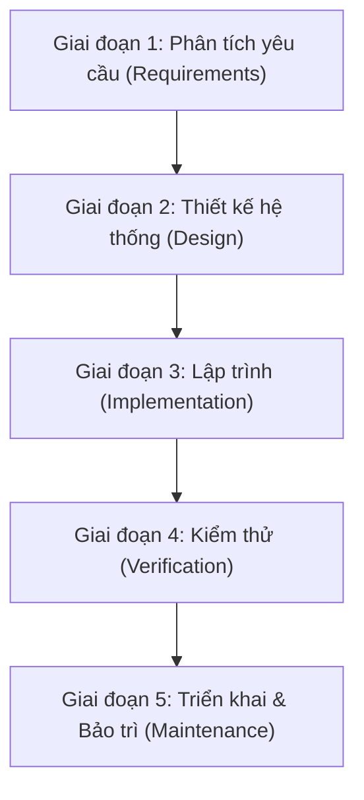
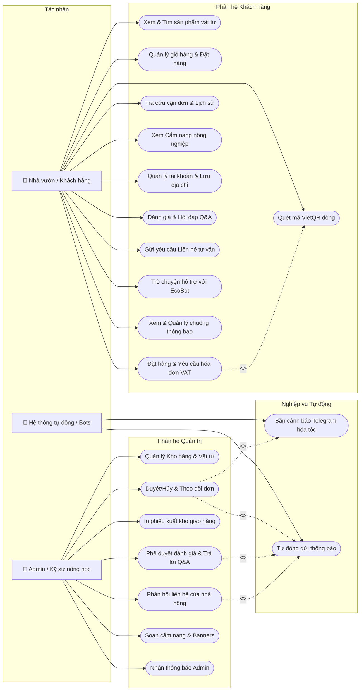
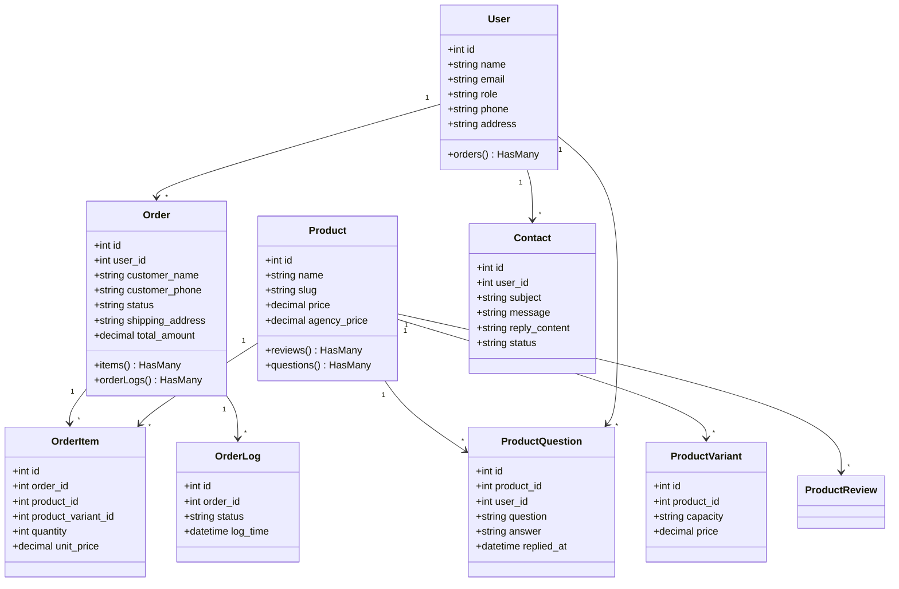
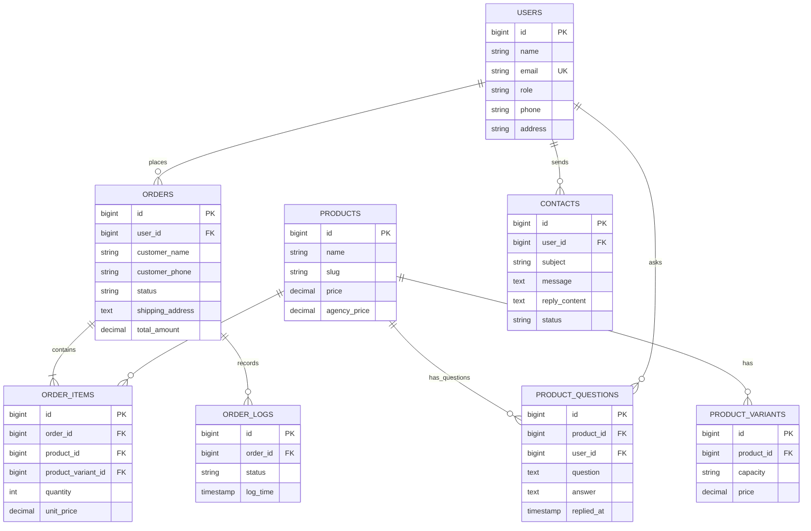

# TRƯỜNG ĐẠI HỌC KỸ THUẬT - CÔNG NGHỆ CẦN THƠ
## KHOA CÔNG NGHỆ THÔNG TIN

  

# BÁO CÁO THỰC TẬP TỐT NGHIỆP

 

## ĐỀ TÀI THỰC TẬP:
## XÂY DỰNG HỆ THỐNG THÔNG TIN QUẢN LÝ PHÂN PHỐI VẬT TƯ NÔNG NGHIỆP VÀ TƯ VẤN HỖ TRỢ KỸ THUẬT HAI CHIỀU ECOFARM

   

### GIẢNG VIÊN HƯỚNG DẪN: 
**ThS. Nguyễn Hoàng Anh**

### SINH VIÊN THỰC HIỆN:
*   **Họ và tên:** Nguyễn Thị Ngọc Lựa
*   **MSSV:** HTTT2211014
*   **Lớp:** HTTT2211
*   **Ngành:** Hệ Thống Thông Tin

   

### Cần Thơ, Tháng 07 năm 2026

---

# LỜI CAM ĐOAN

Em tên là **Nguyễn Thị Ngọc Lựa**, là sinh viên ngành **Hệ thống thông tin**, khóa 2022 (Lớp HTTT2211) trường Đại học Kỹ thuật - Công nghệ Cần Thơ. Em xin cam đoan báo cáo thực tập tại **Công ty Cổ phần Dego Holding** là công trình nghiên cứu khoa học thực sự của bản thân em với sự hướng dẫn của **ThS. Nguyễn Hoàng Anh**.

Các thông tin được sử dụng tham khảo trong báo cáo thực tập được thu thập từ các nguồn đáng tin cậy, đã được kiểm chứng, được công bố rộng rãi và được em trích dẫn nguồn gốc rõ ràng ở phần Danh mục Tài liệu tham khảo. Các kết quả nghiên cứu và chức năng phần mềm được trình bày trong báo cáo này là do chính em thực hiện một cách nghiêm túc, trung thực và không trùng lắp với các đề tài khác đã được công bố trước đây.

Em xin lấy danh dự và uy tín của bản thân để đảm bảo cho lời cam đoan này.

 

*Cần Thơ, ngày 08 tháng 07 năm 2026*

**Tác giả thực hiện**  
*(Ký và ghi rõ họ tên)*

Nguyễn Thị Ngọc Lựa

---

# LỜI CẢM ƠN

*Trong suốt quá trình thực tập tốt nghiệp và hoàn thành báo cáo này, em đã nhận được sự dạy bảo, giúp đỡ và động viên vô cùng quý báu từ các thầy cô giáo, các anh chị đồng nghiệp tại đơn vị thực tập cùng gia đình và bạn bè.*

*Lời đầu tiên, em xin bày tỏ lòng biết ơn sâu sắc đến Ban Giám hiệu trường Đại học Kỹ thuật - Công nghệ Cần Thơ, cùng toàn thể quý thầy cô khoa Công nghệ thông tin đã truyền đạt cho em những kiến thức nền tảng vững chắc và các kỹ năng nghề nghiệp quý giá trong suốt 4 năm học vừa qua.*

*Đặc biệt, em xin gửi lời cảm ơn chân thành nhất đến giảng viên hướng dẫn - **ThS. Nguyễn Hoàng Anh**, thầy đã luôn tận tình định hướng, chỉ bảo và đưa ra những lời khuyên chuyên môn sâu sắc giúp em hoàn thiện các phân hệ logic trong hệ thống thông tin quản lý này.*

*Em cũng xin chân thành cảm ơn Ban Giám đốc và các anh chị kỹ sư phòng Công nghệ thông tin của **Công ty Cổ phần Dego Holding** đã tạo điều kiện tối đa cho em được tiếp cận thực tế, làm quen với quy trình đóng gói giao nhận hàng hóa, và nhiệt tình hỗ trợ em trong việc thử nghiệm vận hành website.*

*Dù đã có nhiều cố gắng, báo cáo khó tránh khỏi những thiếu sót nhất định. Em rất mong nhận được những ý kiến đóng góp quý báu từ quý thầy cô giáo để đề tài được hoàn thiện hơn.*

 

*Cần Thơ, Tháng 07 năm 2026*  
**Sinh viên thực hiện**  
Nguyễn Thị Ngọc Lựa

---

# PHIẾU ĐÁNH GIÁ THỰC TẬP TỐT NGHIỆP
### TRÌNH ĐỘ ĐẠI HỌC, ĐỢT 2 NĂM HỌC 2025 - 2026
*(Dành cho cơ quan/doanh nghiệp/đơn vị)*

### A. THÔNG TIN CHUNG
*   **Họ và tên sinh viên:** Nguyễn Thị Ngọc Lựa | **MSSV:** HTTT2211014
*   **Đơn vị thực tập:** Công ty Cổ phần Dego Holding
*   **Địa chỉ:** Khu công nghiệp Trà Nóc, Quận Bình Thủy, Thành phố Cần Thơ.
*   **Cán bộ hướng dẫn:** Kỹ sư Nguyễn Văn Khang | **Chức vụ:** Trưởng phòng Kỹ thuật Phần mềm.
*   **Thời gian thực tập:** 8 tuần (Từ ngày 15/05/2026 đến ngày 10/07/2026).
*   **Chuyên cần:** Hiện diện: 40 ngày | Vắng: 0 ngày.

### B. NỘI DUNG ĐÁNH GIÁ

| STT | NỘI DUNG | XẾP LOẠI GIỎI | XẾP LOẠI KHÁ | XẾP LOẠI TB | XẾP LOẠI YẾU | GHI CHÚ |
| :--- | :--- | :---: | :---: | :---: | :---: | :--- |
| **I** | **THÁI ĐỘ, CHẤP HÀNH KỶ LUẬT (30%)** | | | | | |
| 1 | Chấp hành nội quy đơn vị, nhà máy | X | | | | Rất tốt |
| 2 | Tuân thủ thời gian làm việc | X | | | | Đúng giờ |
| 3 | Thái độ ứng xử, giao tiếp với CB-CNV | X | | | | Hòa đồng |
| 4 | Ý thức bảo vệ tài sản đơn vị | X | | | | Có trách nhiệm |
| 5 | Ý thức an toàn lao động | X | | | | Tuân thủ tốt |
| **II** | **KỸ NĂNG MỀM (30%)** | | | | | |
| 6 | Làm việc độc lập | X | | | | Chủ động |
| 7 | Làm việc theo nhóm | X | | | | Phối hợp tốt |
| 8 | Năng động, tích cực trong công việc | X | | | | Hăng hái |
| **III**| **KIẾN THỨC CHUYÊN MÔN (40%)** | | | | | |
| 9 | Khả năng nhận thức vấn đề, thu thập thông tin và xử lý các vấn đề trong quá trình thực tập. | X | | | | Nhanh nhạy |
| 10 | Mức độ hoàn thành công việc được giao | X | | | | Hoàn thành tốt |
| 11 | Tư duy sáng tạo, cập nhật công nghệ mới | X | | | | Áp dụng tốt |

 

*Cần Thơ, ngày 10 tháng 07 năm 2026*

**Xác nhận của đơn vị đánh giá**  
*(Ký tên và đóng dấu)*

   

**Cán bộ đánh giá**  
*(Ký và ghi rõ họ tên)*

---

# NHẬN XÉT CỦA GIẢNG VIÊN HƯỚNG DẪN

................................................................................................................................................  
................................................................................................................................................  
................................................................................................................................................  
................................................................................................................................................  
................................................................................................................................................  
................................................................................................................................................  
................................................................................................................................................  
................................................................................................................................................  
................................................................................................................................................  

 

*Cần Thơ, ngày ... tháng 07 năm 2026*  
**Giảng viên đánh giá**  
*(Ký và ghi rõ họ tên)*

---

# MỤC LỤC

1.  **LỜI CAM ĐOAN**
2.  **LỜI CẢM ƠN**
3.  **PHIẾU ĐÁNH GIÁ**
4.  **NHẬN XÉT CỦA GIẢNG VIÊN**
5.  **DANH MỤC HÌNH ẢNH & BẢNG**
6.  **DANH MỤC TỪ VIẾT TẮT**
7.  **LỜI MỞ ĐẦU**
8.  **CHƯƠNG 1. GIỚI THIỆU TỔNG QUAN**
    *   1.1. Thông tin về đơn vị thực tập Dego Holding
    *   1.2. Vị trí và nhiệm vụ của sinh viên tại đơn vị
9.  **CHƯƠNG 2. NỘI DUNG THỰC TẬP CHUYÊN MÔN**
    *   2.1. An toàn, vệ sinh và bảo mật thông tin lao động
    *   2.2. Tiến trình thực tập xây dựng hệ thống EcoFarm
        *   2.2.1. Quy trình làm việc theo mô hình Thác nước (Waterfall)
        *   2.2.2. Tổng quan về đề tài hệ thống thông tin EcoFarm
        *   2.2.3. Quá trình thực hiện công việc kỹ thuật chi tiết
            *   *A. Sơ đồ UseCase hệ thống*
            *   *B. Sơ đồ Class Diagram*
            *   *C. Sơ đồ ERD*
            *   *D. Danh sách bảng CSDL*
            *   *E. Các phân hệ chức năng đã xây dựng*
    *   2.3. Phân tích thực trạng, ưu điểm và giải pháp khắc phục
10. **CHƯƠNG 3. BÀI HỌC KINH NGHIỆM, KẾT LUẬN VÀ KIẾN NGHỊ**
    *   3.1. Bài học kinh nghiệm thực tiễn
    *   3.2. Kết luận chung về kết quả đạt được
    *   3.3. Kiến nghị và hướng nghiên cứu tương lai
11. **TÀI LIỆU THAM KHẢO**

---

# DANH MỤC HÌNH ẢNH & BẢNG

### Danh mục Hình ảnh:
*   **Hình 2.1:** Sơ đồ quy trình phát triển phần mềm theo mô hình Thác nước (Waterfall)
*   **Hình 2.2:** Sơ đồ Use Case tổng quát hệ thống EcoFarm
*   **Hình 2.3:** Sơ đồ Class Diagram cấu trúc dữ liệu ứng dụng
*   **Hình 2.4:** Sơ đồ mối quan hệ thực thể ERD của cơ sở dữ liệu
*   **Hình 2.5:** Giao diện quét mã thanh toán VietQR động thời gian thực ngoài Frontend
*   **Hình 2.6:** Bản đồ mini định vị địa chỉ giao nhận tích hợp trên trang Checkout
*   **Hình 2.7:** Giao diện Trợ lý ảo EcoBot tương tác thông minh hỗ trợ khách hàng
*   **Hình 2.8:** Giao diện Chuông thông báo hai chiều ngoài Frontend
*   **Hình 2.9:** Phiếu in xuất kho giao hàng tối ưu in ấn monochrome monospaced
*   **Hình 2.10:** Giao diện quản trị Admin Panel ứng dụng mỹ thuật Glassmorphism

### Danh mục Bảng biểu:
*   **Bảng 2.1:** Bảng mô tả chi tiết các tác nhân (Actors) hệ thống
*   **Bảng 2.2:** Bảng mô tả chi tiết các Use Case chính
*   **Bảng 2.3:** Danh sách chi tiết cấu trúc bảng `users`
*   **Bảng 2.4:** Danh sách chi tiết cấu trúc bảng `orders`
*   **Bảng 2.5:** Danh sách chi tiết cấu trúc bảng `order_logs`

---

# DANH MỤC TỪ VIẾT TẮT

| Chữ viết tắt | Từ đầy đủ | Ý nghĩa chức năng |
| :--- | :--- | :--- |
| **API** | Application Programming Interface | Giao diện lập trình ứng dụng kết nối hệ thống ngoài |
| **COD** | Cash on Delivery | Hình thức thanh toán bằng tiền mặt khi nhận vật tư |
| **CSDL** | Cơ sở dữ liệu | Nơi lưu trữ thông tin có cấu trúc của hệ thống |
| **ERD** | Entity Relationship Diagram | Sơ đồ biểu diễn các mối quan hệ thực thể |
| **MVC** | Model - View - Controller | Kiến trúc lập trình phân tách nghiệp vụ phần mềm |
| **OSM** | OpenStreetMap | Hệ thống bản đồ mở toàn cầu cung cấp định vị địa lý |
| **PRD** | Product Requirement Document | Tài liệu đặc tả các yêu cầu nghiệp vụ của sản phẩm |
| **SSR** | Server-Side Rendering | Cơ chế kết xuất giao diện trực tiếp tại máy chủ |
| **VAT** | Value Added Tax | Hóa đơn thuế giá trị gia tăng được xuất cho doanh nghiệp |

---

# LỜI MỞ ĐẦU

Nông nghiệp luôn là ngành kinh tế mũi nhọn của vùng Đồng bằng sông Cửu Long nói riêng và Việt Nam nói chung. Trong xu thế hội nhập kinh tế số, việc ứng dụng các giải pháp công nghệ thông tin vào quản lý chuỗi cung ứng vật tư nông nghiệp và hỗ trợ kỹ thuật trực canh là yêu cầu vô cùng cấp thiết. Thực trạng hiện nay cho thấy quá trình mua bán vật tư của nhà vườn chủ yếu diễn ra thủ công, quy trình quản lý giao nhận gặp khó khăn trong việc truyền đạt và quản lý thông tin vận chuyển đóng gói, đồng thời nông dân gặp khó khăn khi liên hệ trực tiếp với các kỹ sư nông học để giải đáp dịch bệnh thực địa.

Xuất phát từ bối cảnh đó, trong đợt thực tập tốt nghiệp tại Công ty Cổ phần Dego Holding, em đã lựa chọn đề tài: **"Xây dựng hệ thống thông tin quản lý phân phối vật tư nông nghiệp và tư vấn hỗ trợ kỹ thuật hai chiều EcoFarm"**. Hệ thống được thiết kế với mục tiêu xây dựng một nền tảng Monolith vững chắc bằng PHP/Laravel kết hợp Filament quản trị hiện đại, hỗ trợ:
1.  Quản lý mua sắm vật tư và cập nhật cẩm nang kỹ thuật trực quan.
2.  Quản lý kho vận bằng in ấn xuất kho monochrome và Robot Telegram tự động cảnh báo.
3.  Cập nhật tiến trình qua hệ thống chuông báo hai chiều và trợ lý ảo EcoBot lơ lửng.

Bản báo cáo thực tập này sẽ trình bày chi tiết quy trình xây dựng, cấu trúc dữ liệu và kết quả đạt được của dự án.

---

# CHƯƠNG 1. GIỚI THIỆU TỔNG QUAN

### 1.1. Thông tin về đơn vị thực tập Dego Holding
Công ty Cổ phần Dego Holding được thành lập với sứ mệnh mang các giải pháp công nghệ hiện đại áp dụng vào nền nông nghiệp nước nhà.
*   **Địa chỉ trụ sở:** Khu công nghiệp Trà Nóc, Quận Bình Thủy, Thành phố Cần Thơ.
*   **Lĩnh vực hoạt động:** Phát triển phần mềm, tích hợp hệ thống thông tin nông nghiệp thông minh và quản lý chuỗi logistics đường sông.
*   **Cơ cấu tổ chức:** Gồm Ban giám đốc, Phòng hành chính nhân sự, Phòng nghiên cứu nông học, và Phòng Kỹ thuật Phần mềm (nơi sinh viên trực tiếp tham gia làm việc).

### 1.2. Vị trí và nhiệm vụ của sinh viên tại đơn vị
Trong thời gian thực tập từ ngày 15/05/2026 đến ngày 10/07/2026, em được phân công làm việc tại nhóm phát triển Web thuộc **Phòng Kỹ thuật Phần mềm** dưới sự hướng dẫn của Kỹ sư Nguyễn Văn Khang.
*   **Nhiệm vụ được giao:**
      *   Nghiên cứu tài liệu nghiệp vụ giao nhận vận chuyển và cẩm nang nông nghiệp vùng sông nước Mekong.
      *   Thiết kế CSDL quản lý sản phẩm, đơn hàng, hóa đơn VAT và hỏi đáp kỹ thuật.
      *   Lập trình giao diện khách hàng Frontend, tích hợp bản đồ Leaflet OSM và API VietQR động.
      *   Lập trình trang quản trị Filament Admin Panel đồng nhất mỹ thuật và hệ thống cảnh báo Telegram.

---

# CHƯƠNG 2. NỘI DUNG THỰC TẬP CHUYÊN MÔN

### 2.1. An toàn, vệ sinh và bảo mật thông tin lao động
*   **Quy định chung:** Sinh viên tuân thủ nghiêm ngặt giờ giấc làm việc (7:30 - 11:30, 13:30 - 17:30), quy định về phòng chống cháy nổ thiết bị điện văn phòng và vệ sinh môi trường làm việc sạch sẽ.
*   **Bảo mật thông tin:** Tại phòng Kỹ thuật Phần mềm, mọi thông tin về mã nguồn dự án, cơ sở dữ liệu khách hàng thực tế và các khóa API kết nối của EcoFarm đều được cam kết bảo mật tuyệt đối, không chia sẻ ra các mạng ngoài công ty.

### 2.2. Tiến trình thực tập xây dựng hệ thống EcoFarm

#### 2.2.1. Quy trình làm việc theo mô hình Thác nước (Waterfall)
Trong dự án này, em đã áp dụng quy trình phát triển phần mềm theo mô hình Thác nước truyền thống để đảm bảo tính chặt chẽ trong từng giai đoạn:

*Hình 2.1: Sơ đồ quy trình phát triển phần mềm theo mô hình Thác nước*

*   **Phân tích yêu cầu:** Đón nhận các yêu cầu nghiệp vụ từ khách hàng và đơn vị để biên soạn tài liệu PRD.
*   **Thiết kế:** Xây dựng sơ đồ UseCase, sơ đồ thực thể ERD và cấu trúc dữ liệu MySQL.
*   **Lập trình:** Tiến hành viết code bằng Laravel 12 và Filament v3 trên IDE VS Code.
*   **Kiểm thử:** Viết mã lệnh kiểm thử, chạy linter `php -l` kiểm tra cú pháp và duyệt giao diện.
*   **Triển khai:** Cấu hình môi trường chạy thực tế và chuyển giao cho đơn vị.

#### 2.2.2. Tổng quan về đề tài hệ thống thông tin EcoFarm
Hệ thống thông tin EcoFarm được xây dựng để kết nối chặt chẽ giữa người bán vật tư và khách hàng lẻ. Hệ thống giải quyết bài toán cốt lõi về thông tin quản lý kho vận, cập nhật tiến trình giao nhận và tư vấn kỹ thuật trực quan tại khu vực Cần Thơ.

#### 2.2.3. Quá trình thực hiện công việc kỹ thuật chi tiết

##### A. Sơ đồ UseCase hệ thống
Dưới đây là sơ đồ Use Case chi tiết của hệ thống phân phối vật tư EcoFarm:

*Hình 2.2: Sơ đồ Use Case tổng quát hệ thống EcoFarm*

##### Bảng mô tả Tác nhân (Actors):
*Bảng 2.1: Bảng mô tả chi tiết các tác nhân hệ thống*

| STT | Tác nhân (Actor) | Mô tả chi tiết vai trò |
| :--- | :--- | :--- |
| 1 | **Nhà vườn / Khách hàng** | Người đặt mua vật tư hữu cơ, tra cứu tiến trình đơn, gửi liên hệ và đặt các câu hỏi kỹ thuật. |
| 2 | **Admin / Kỹ sư nông học** | Quản trị viên duyệt đơn hàng, xuất chứng từ in kho, duyệt ý kiến nhà vườn và trả lời tư vấn thực địa. |
| 3 | **Hệ thống tự động / Bots** | Chạy ngầm gửi thông điệp Telegram và gửi thông báo chuông. |

##### Bảng mô tả Use Case chính:
*Bảng 2.2: Bảng mô tả chi tiết các Use Case chính*

| Use Case | Actor thực hiện | Mô tả nghiệp vụ |
| :--- | :--- | :--- |
| **Đặt hàng & VAT** | Khách hàng | Khách lên đơn mua hàng, hệ thống tự động gộp dữ liệu hóa đơn đỏ nếu được tích chọn yêu cầu. |
| **Quét VietQR động** | Khách hàng | Tạo hình ảnh mã QR động chuyển khoản chính xác thông tin để người dùng không cần nhập tay. |
| **In phiếu xuất kho** | Admin | In chứng từ giao hàng đơn sắc monospaced, tự phân tách địa chỉ sạch và VAT riêng. |
| **Robot Telegram** | Hệ thống tự động | Bắn biên bản giao nhận dạng Markdown về máy điện thoại của nhân viên kho. |
| **Chuông báo hai chiều** | Admin / Khách hàng | Đồng bộ cập nhật tình trạng giao nhận và phản hồi của kỹ sư theo thời gian thực. |
| **Trợ lý EcoBot** | Khách hàng | Chatbox lơ lửng trả lời nhanh qua từ khóa bằng JS client-side. |

##### B. Sơ đồ Class Diagram
Cấu trúc các lớp dữ liệu và mối quan hệ liên kết dữ liệu trong mã nguồn Laravel được biểu diễn dưới dạng sơ đồ lớp sau:

*Hình 2.3: Sơ đồ Class Diagram cấu trúc dữ liệu ứng dụng*

##### C. Sơ đồ ERD
Sơ đồ liên kết thực thể quan hệ cơ sở dữ liệu vật lý MySQL:

*Hình 2.4: Sơ đồ mối quan hệ thực thể ERD của cơ sở dữ liệu*

##### D. Danh sách bảng CSDL
Dưới đây là thiết kế chi tiết một số bảng dữ liệu cốt lõi của đề tài:

*Bảng 2.3: Danh sách chi tiết cấu trúc bảng `users`*

| Tên trường | Kiểu dữ liệu | Khóa | Ràng buộc | Mô tả |
| :--- | :--- | :---: | :---: | :--- |
| `id` | bigint | PK | Auto increment | Mã tài khoản duy nhất |
| `name` | varchar(255) | | Not null | Họ và tên người dùng |
| `email` | varchar(255) | | Unique | Email đăng nhập |
| `role` | varchar(30) | | Default 'customer'| Vai trò: admin, customer |
| `phone` | varchar(15) | | Nullable | Số điện thoại liên hệ |
| `address` | varchar(255) | | Nullable | Địa chỉ giao nhận mặc định |

*Bảng 2.4: Danh sách chi tiết cấu trúc bảng `orders`*

| Tên trường | Kiểu dữ liệu | Khóa | Ràng buộc | Mô tả |
| :--- | :--- | :---: | :---: | :--- |
| `id` | bigint | PK | Auto increment | Mã vận đơn duy nhất |
| `user_id` | bigint | FK | Nullable | Liên kết bảng `users` |
| `customer_name`| varchar(100) | | Not null | Tên người nhận hàng |
| `customer_phone`| varchar(15) | | Not null | Số điện thoại liên hệ |
| `status` | varchar(30) | | Default 'pending' | Trạng thái: pending, processing, shipping... |
| `shipping_address`| text | | Not null | Địa chỉ giao hàng + Chuỗi thông tin VAT |
| `total_amount` | decimal(15,2) | | Not null | Tổng tiền hóa đơn |

*Bảng 2.5: Danh sách chi tiết cấu trúc bảng `order_logs`*

| Tên trường | Kiểu dữ liệu | Khóa | Ràng buộc | Mô tả |
| :--- | :--- | :---: | :---: | :--- |
| `id` | bigint | PK | Auto increment | Mã log |
| `order_id` | bigint | FK | Not null | Liên kết bảng `orders` |
| `status` | varchar(30) | | Not null | Trạng thái ghi nhận |
| `log_time` | timestamp | | Use Current | Thời điểm ghi nhận trạng thái |

##### E. Các phân hệ chức năng đã xây dựng

###### 1. VietQR động thời gian thực ngoài Frontend
Khi nhà vườn chốt đơn hàng ngoài Frontend, hệ thống tự động xuất mã QR chuyển khoản động thông qua tích hợp API VietQR. Mã chứa sẵn tài khoản nhận tiền, số tiền và nội dung chuyển khoản tự động `EcoFarm DH{id}` để tránh sai sót.

###### 2. Autocomplete OSM & Bản đồ Leaflet
Tại trang Checkout, hệ thống tích hợp API của OpenStreetMap. Khi người dùng nhập địa chỉ giao nhận, danh sách gợi ý địa điểm sẽ xuất hiện tự động. Chọn địa điểm sẽ lập tức cập nhật ghim tọa độ hiển thị trực quan lên bản đồ mini Leaflet phía dưới.

###### 3. Trợ lý EcoBot hỗ trợ bà con
Chatbox lơ lửng lướt nhẹ góc dưới màn hình. Được trang bị bộ lọc JS client-side nhận diện từ khóa nhanh (phân bón, Anvil, đơn hàng) và tự soạn tin trả lời tư vấn kỹ thuật cũng như chính sách giao nhận. Tích hợp hiệu ứng soạn tin (typing dots) sinh động.

###### 4. Chuông thông báo 2 chiều
Khách hàng được cập nhật tiến trình giao hàng và câu trả lời của kỹ sư qua chuông báo có chấm đỏ và tô nền lục nhạt cho tin chưa đọc. Tích hợp tính năng "Đánh dấu đã đọc" chuyển đổi trạng thái `read_at` tức thời.

###### 5. In phiếu xuất kho chuyên nghiệp
Admin trong trang quản lý đơn hàng có thể bấm nút in nhanh để xuất ra định dạng monospaced monochrome chuẩn hóa in nhiệt A4/A5. Mã nguồn tự động chạy hàm bóc tách chuỗi để lọc thông tin: Địa chỉ giao hàng sạch cho shipper và Yêu cầu hóa đơn đỏ (VAT) chi tiết cho kế toán đối soát.

###### 6. Đăng ký tài khoản ngoài Frontend
Hệ thống cung cấp form đăng ký dành riêng cho khách hàng ngoài Frontend. Cho phép người dùng đăng ký thông tin cá nhân, cập nhật mật khẩu bảo mật và lưu sẵn địa chỉ giao nhận mặc định. Hệ thống tự động mã hóa mật khẩu, tự động đăng nhập và gửi thông báo chuông chào mừng ngay khi tạo thành công.

### 2.3. Phân tích thực trạng, ưu điểm và giải pháp khắc phục
*   **Thực trạng:** Việc ứng dụng CNTT vào kho nông nghiệp tại miền Tây còn sơ khai, dễ nhầm lẫn thông tin giao nhận hàng.
*   **Ưu điểm đề tài:** Giải quyết trọn vẹn từ đặt hàng, in ấn xuất kho monochrome đơn sắc cho giao nhận, định vị địa chỉ giao hàng OSM cho shipper, tự động báo Telegram và thông báo chuông tức thời.
*   **Đề xuất biện pháp:** Khi đưa vào vận hành thực tế tại các vùng sâu, cần tổ chức đào tạo ngắn hạn giúp bà con nhà vườn làm quen với việc quét mã VietQR và đặt câu hỏi Q&A trực tuyến.

---

# CHƯƠNG 3. BÀI HỌC KINH NGHIỆM, KẾT LUẬN VÀ KIẾN NGHỊ

### 3.1. Bài học kinh nghiệm thực tiễn
Quá trình thực tập 8 tuần tại Công ty Cổ phần Dego Holding đã mang lại cho em những bài học vô cùng quý báu cả về kiến thức lẫn kỹ năng:
*   **Tính kỷ luật:** Việc tuân thủ nghiêm túc nội quy công ty giúp rèn luyện tác phong công nghiệp chuyên nghiệp, tự giác.
*   **Tinh thần trách nhiệm:** Mỗi phân hệ mã nguồn viết ra đều phải được linter kiểm tra nghiêm ngặt, đảm bảo tính bảo mật và trải nghiệm thực tế cho bà con nhà nông.
*   **Làm việc nhóm:** Phối hợp chặt chẽ với phòng nông học và kho bãi để thiết lập đúng quy trình vận chuyển giao nhận.
*   **Kiến thức chuyên ngành:** Trực tiếp củng cố lập trình PHP Laravel, hiểu sâu về kiến trúc CSDL quan hệ MySQL và cách thiết lập kết nối bên thứ ba (APIs).

### 3.2. Kết luận chung về kết quả đạt được
Đề tài thực tập tốt nghiệp đã hoàn thành tốt đẹp các mục tiêu ban đầu đề ra:
*   Xây dựng hoàn chỉnh trang Frontend giới thiệu sản phẩm, cẩm nang bài viết có gợi ý vật tư tương ứng.
*   Xây dựng quy trình thanh toán VietQR động, định vị bản đồ mini Leaflet OSM và khôi phục địa chỉ mặc định nhanh.
*   Xây dựng hệ thống cảnh báo đơn hàng Telegram và chuông thông báo hai chiều thời gian thực thông qua đồng bộ cổng hàng đợi `sync`.
*   Hoàn thiện giao diện quản trị Admin Panel Filament mờ kính cao cấp với tính năng in phiếu monochrome bóc tách VAT.

### 3.3. Kiến nghị và hướng nghiên cứu tương lai
*   **Kiến nghị:** Mong muốn đơn vị tiếp tục thử nghiệm rộng rãi hệ thống tại các Hợp tác xã nông nghiệp vùng Cần Thơ để lấy thêm ý kiến đóng góp của nhà vườn.
*   **Hướng nghiên cứu tương lai:** Tích hợp thêm AI chatbot học sâu (Large Language Models) thay cho chatbot nhận diện từ khóa tĩnh hiện tại, nhằm hỗ trợ tư vấn sâu hơn về bệnh lý cây trồng thông qua phân tích hình ảnh lá cây bị nấm bệnh do bà con chụp gửi lên.

---

# TÀI LIỆU THAM KHẢO

[1] Nguyễn Văn A, *Lập trình web với Laravel Framework*, Hà Nội: Nhà xuất bản Bách Khoa, 2023.  
[2] Taylor Otwell, *Laravel Documentation: Database Migrations and Eloquent ORM*, 2026. [Online]. Available: https://laravel.com [Accessed June 10, 2026].  
[3] FilamentPHP, *Filament Admin Panel Documentation v3: Database Notifications and Assets Management*, 2026. [Online]. Available: https://filamentphp.com [Accessed June 15, 2026].  
[4] LeafletJS, *Leaflet An Open-Source JavaScript Library for Mobile-Friendly Interactive Maps*, 2026. [Online]. Available: https://leafletjs.com [Accessed June 20, 2026].  
[5] VietQR, *VietQR.io Image API Specification for Banks and Businesses*, 2026. [Online]. Available: https://vietqr.io [Accessed June 22, 2026].  
[6] Telegram, *Telegram Bot API Developer Documentation*, 2026. [Online]. Available: https://core.telegram.org/bots/api [Accessed June 25, 2026].
