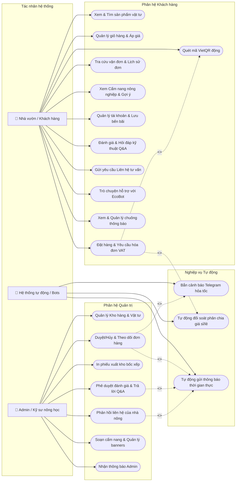

# Báo cáo Dự án Hệ thống thông tin Quản lý Vật tư Nông nghiệp EcoFarm

*   **Học phần:** Hệ thống thông tin quản lý doanh nghiệp
*   **Sinh viên thực hiện:** Nguyễn Thị Ngọc Lựa
*   **Thương hiệu:** EcoFarm
*   **Địa bàn hoạt động:** Khu vực Đồng bằng sông Cửu Long (Bến bãi: KCN Trà Nóc, Bình Thủy, Cần Thơ)

---

## 1. Giới thiệu Dự án
EcoFarm là nền tảng thương mại điện tử chuyên biệt cung cấp vật tư nông nghiệp (phân bón, thuốc bảo vệ thực vật, hạt giống) chính hãng, chất lượng cao dành cho nhà vườn và đại lý. 

Điểm khác biệt cốt lõi của EcoFarm là tích hợp **Hệ thống tương tác hai chiều** hỗ trợ tư vấn kỹ thuật trực canh và tự động hóa quy trình bốc xếp bến bãi, giúp tối ưu hóa chuỗi cung ứng vật tư nông nghiệp tại khu vực miền Tây.

---

## 2. Công nghệ Áp dụng (Technology Stack)
*   **Lõi hệ thống:** Laravel 12 (PHP 8.2), MVC Framework.
*   **Giao diện quản trị:** Filament v3 (Livewire 3, Alpine.js, TailwindCSS) - Thiết kế Glassmorphism bo tròn 16px tùy chỉnh.
*   **Giao diện khách hàng:** Bootstrap 5, CSS3, FontAwesome 6, Google Font *Plus Jakarta Sans*.
*   **Cơ sở dữ liệu:** MySQL (Đồng bộ bảng mã `utf8mb4_unicode_ci` loại bỏ lỗi xung đột Collation).
*   **Bản đồ & Định vị:** Leaflet API & Nominatim OpenStreetMap (Autocomplete gợi ý địa chỉ).
*   **Thanh toán:** API VietQR (Tự động xuất mã QR chuyển khoản động).
*   **Tích hợp Robot ngầm:** Telegram Bot API (Soạn biên bản bốc xếp dạng Markdown và gửi tin nhắn hỏa tốc).

---

## 3. Cấu trúc Cơ sở dữ liệu (Database Schema)
Hệ thống quản lý dữ liệu thông qua 21 bảng vật lý, dưới đây là các bảng cốt lõi:
1.  `users`: Lưu trữ thông tin tài khoản (Phân quyền `role`: admin, staff, agency, customer; lưu số điện thoại và địa chỉ bến nhận mặc định).
2.  `products` & `product_variants`: Lưu trữ vật tư, quy cách đóng gói (dung tích/khối lượng) và giá bán tương ứng.
3.  `orders` & `order_items`: Lưu thông tin vận đơn, địa chỉ bến nhận hàng, tổng tiền, phương thức thanh toán và danh mục chi tiết sản phẩm.
4.  `order_logs`: Nhật ký tiến trình đóng gói, bốc xếp bến bãi phục vụ tra cứu.
5.  `product_reviews`: Đánh giá chất lượng sản phẩm từ nhà nông (phê duyệt bởi admin).
6.  `product_questions`: Câu hỏi kỹ thuật của nhà nông gửi tới kỹ sư và câu trả lời tương ứng.
7.  `contacts`: Các yêu cầu liên hệ, đề nghị báo giá và tư vấn từ người dùng.
8.  `notifications`: Lưu trữ thông báo cơ sở dữ liệu thời gian thực cho cả admin và khách hàng.
9.  `banners`: Quản lý hình ảnh quảng cáo động ngoài trang chủ.
10. `posts`: Cẩm nang kỹ thuật canh tác nông nghiệp.

---

## 4. Bản đồ Use Case Hệ thống (Mermaid Diagram)
Hệ thống phân quyền rõ ràng giữa Khách hàng (Nhà vườn) và Ban quản trị (Kỹ sư nông học):

---

## 5. Các Tính năng Điểm nhấn Kỹ thuật nổi bật

### A. Quy trình Thanh toán & Xuất hóa đơn VAT tinh sạch
*   **Cơ chế lưu trữ:** Thông tin yêu cầu xuất hóa đơn đỏ (Tên công ty & Mã số thuế) được nối chuỗi thông minh vào cuối địa chỉ nhận hàng để đảm bảo tính gọn nhẹ của CSDL.
*   **Bóc tách tự động:** Khi In phiếu xuất kho hoặc bắn thông tin về Telegram, hệ thống sử dụng thuật toán bóc tách chuỗi để:
    *   Làm sạch nhãn bến giao nhận (lược bỏ phần thông tin VAT dính kèm để shipper dễ quan sát).
    *   Trình bày thông tin hóa đơn đỏ riêng biệt: `VAT đỏ: YÊU CẦU XUẤT HĐ (Tên Công ty - MST: Mã số thuế)` phục vụ kế toán xuất hóa đơn tài chính chính xác.

### B. Robot Cảnh báo bốc xếp Telegram hỏa tốc
*   Khi khách hàng tạo đơn thành công ngoài Frontend, hệ thống tự động gọi `TelegramService` để biên soạn một biên bản bốc xếp dạng Markdown: Mã đơn hàng, Tên khách hàng, Số điện thoại, Địa chỉ bến sạch, Tổng tiền, Phương thức thanh toán và Danh mục bốc xếp vật tư chi tiết (Tên hàng x số lượng x quy cách).
*   Biên bản được bắn thẳng vào nhóm Telegram của bộ phận kho vận. Hệ thống tích hợp cơ chế ghi log dự phòng `telegram.log` đề phòng mất kết nối API mạng.

### C. Trung tâm thông báo hai chiều thời gian thực (Bi-directional Notifications)
*   **Về phía Admin:** Nhận được thông báo chuông lập tức trong Admin Panel khi có đơn hàng mới, đánh giá mới hoặc yêu cầu liên hệ hỗ trợ kỹ thuật mới.
*   **Về phía Khách hàng:** Biểu tượng quả chuông ngoài Frontend hiển thị chấm đỏ khi có tin mới. Tin nhắn chưa đọc được tô màu xanh lục nhạt nổi bật. Khách hàng nhận được tin khi Admin cập nhật trạng thái đơn hàng (ví dụ: đang bốc xếp, đang giao) hoặc phản hồi các câu hỏi kỹ thuật/yêu cầu liên hệ. Có sẵn nút **"Đánh dấu đã đọc"** để làm sạch chấm báo.

### D. Trợ lý ảo EcoBot (EcoBot Chatbox)
*   Cung cấp bong bóng chat lơ lửng góc dưới phải màn hình với phong cách kính mờ (Glassmorphism).
*   Trang bị tính năng giả lập soạn tin nhắn (blinking dots) trong 1 giây để tăng tính tự nhiên.
*   Phân tích từ khóa thông minh để trả lời ngay các thắc mắc về: Liều lượng phun thuốc Anvil, cách bón phân NPK Đầu Trâu, chính sách chiết khấu 15% cho đại lý, cách tra cứu lịch trình bến bãi, hoặc gọi hotline gặp trực tiếp kỹ sư.
